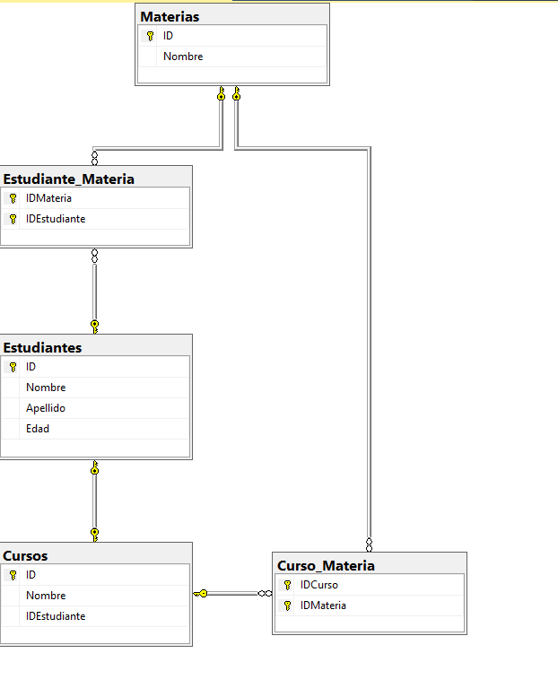

# ASP.NetCore-6-Windows-no-BD-

App ASPE.Net Core 6 MVC con base de datos ya existente, crea los modelos a partir de las tablas en la BD.


Microsoft.EntityFrameworkCore
Microsoft.EntityFrameworkCore.SqlServer
Microsoft.EntityFrameworkCore.Tools

**Consola nuget:**
```
Scaffold-DbContext "Server=192.168.0.20\\SERVER\\SQLEXPRESS,1433;Database=ColegioABC; User Id=bduserX; Password=admin1234; TrustServerCertificate=true;" Microsoft.EntityFrameworkCore.SqlServer -OutputDir Models
```

# Inyección de Dependencias 

*Program.cs* (Agregar conexto de la BD):
```
// Add services to the container.
builder.Services.AddControllersWithViews();

builder.Services.AddDbContext<ColegioAbcContext>();
```


# Sobre la BD

**BD**: ColegioABC \
**Relaciones**: \
Un Estudiante puede pertenecer a un solo Curso,  un Curso puede tener varios Estudiantes.
Una Materia pertenece a varios Cursos y un Estudiante puede estar inscrito en varias Materias.

## ACLARACIONES

Estudiantes uno a muchos Cursos (un estudiante pertenece a un solo curso)
Estudiantes muchos a muchos Materias (Estudiante_Materia)
Cursos muchos a muchos Materias (Curso_Materia)

## Diagrama Entidad Relacion




# Referencias

[Asp.Net Core (Crear Modelos, Controllers y vistas con una base de datos ya creada en SQL SERVER)](https://www.youtube.com/watch?v=xMb1ldPas6E&ab_channel=andresflorez)